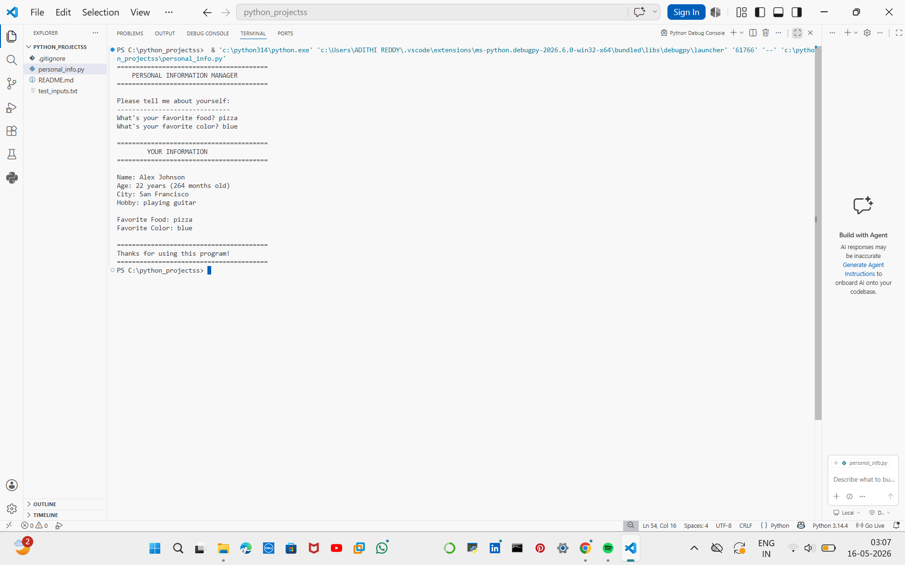

# Week 1: Personal Information Manager

## 🎯 Project Overview
A Python application that captures user data, performs age calculations, and displays a formatted profile.

## 🛠️ Technical Details
- **Logic:** Uses `while` loops for input validation to prevent empty strings.
- **Math:** Calculates age in months ($Age \times 12$) and days ($Age \times 365$).
- **UI:** Implemented custom ASCII borders and Python f-strings for a clean terminal interface.

## 🧠 Challenges & Solutions
- **Challenge:** Handling empty user inputs which could crash later logic.
- **Solution:** Integrated `.strip()` to remove whitespace and a `while` loop to force a valid entry.
- **Challenge:** Creating a readable layout in a text-only terminal.
- **Solution:** Used string multiplication (`"=" * 40`) to create consistent visual separators.

## ⚙️ Setup Instructions
1. Install Python 3.x.
2. Run `python personal_info.py` in your terminal.

